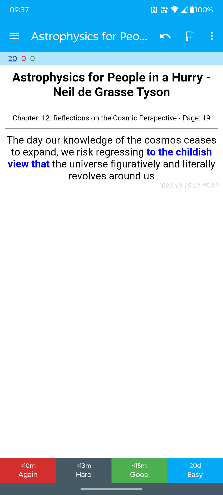

# Koreader Highlights 2 Anki

Generates [Anki](https://ankiweb.net/) flashcards from highlighted text in [KOReader](https://koreader.rocks/) to create cloze deletions.
It utilizes the [BERT](https://huggingface.co/docs/transformers/en/model_doc/bert) model to assess word importance in sentences, allowing for the generation of effective
flashcards for study and revision.

## Installation

```bash
curl -f
https://raw.githubusercontent.com/lbesnard/Koreader_Highlights_2_Anki/refs/heads/main/install.sh | bash
```

## Installation with Poetry
Clone the repo
```bash
pip install poetry
poetry install
```

## Usage

1. Mount your Ebook reader
2. Run the script
3. import the APKG into ANKI

```bash
# If installed from poetry, do `poetry run koreader_highlights_2_anki -h`
koreader_highlights_2_anki -h
usage: koreader_highlights_2_anki [-h] --input-folder INPUT_FOLDER --output-folder OUTPUT_FOLDER [--deck-name DECK_NAME] [--no-ai] [--select-files]

Create Anki flashcards from Koreader highlights.

options:
  -h, --help            show this help message and exit
  --input-folder INPUT_FOLDER, -i INPUT_FOLDER
                        Path to the folder containing metadata.epub.lua files in KOReader.
  --output-folder OUTPUT_FOLDER, -o OUTPUT_FOLDER
                        Path to the folder where .apkg files will be saved.
  --deck-name DECK_NAME, -n DECK_NAME
                        Name of the Anki deck (e.g., 'deck::subdeck') (Default to Books Highlights 📚 .
  --no-ai               Decide if we don't use AI to find which part of the sentence to 'cloze'.
  --select-files        If set, allows you to select files interactively for processing.

example:
poetry run koreader_highlights_2_anki -i /media/KOBOeReader/Ebooks -o ~/Documents --select-files

```

## Example



